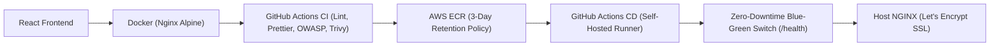

# Todo DevOps Project

A complete, production-grade DevOps implementation for a modern React + Vite application deployed on AWS using Terraform (IaC), GitHub Actions (CI/CD), AWS OIDC, AWS ECR, AWS Lightsail, and zero-downtime Blue-Green deployments with automated rollback.

---

## 📖 Documentation

Complete, detailed setup guides and architectural documentation are available in the **[`docs/`](docs/)** directory:

- 🏛️ **[System Architecture & Diagrams](docs/ARCHITECTURE.md)**: Cloud architecture, network design, OIDC security model, and CI/CD workflow diagrams.
- 🚀 **[Step-by-Step Setup Guide](docs/STEP_BY_STEP_SETUP_GUIDE.md)**: Comprehensive guide to provisioning the infrastructure, configuring GitHub Secrets, setting up remote state, installing self-hosted runners, and securing custom domains with Let's Encrypt SSL.

---

## ⚡ Quick Architecture Overview

