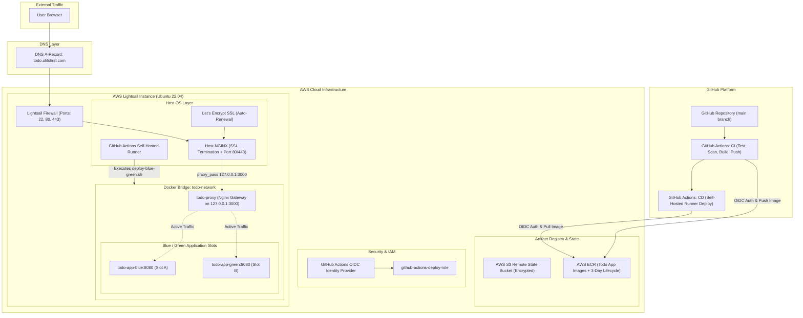
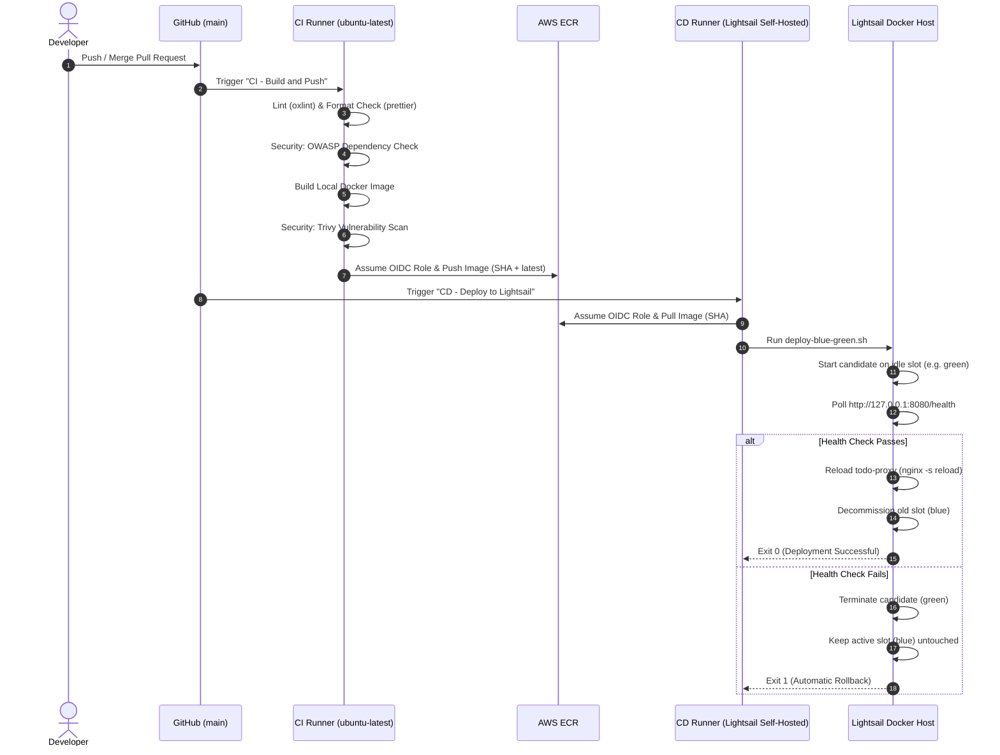
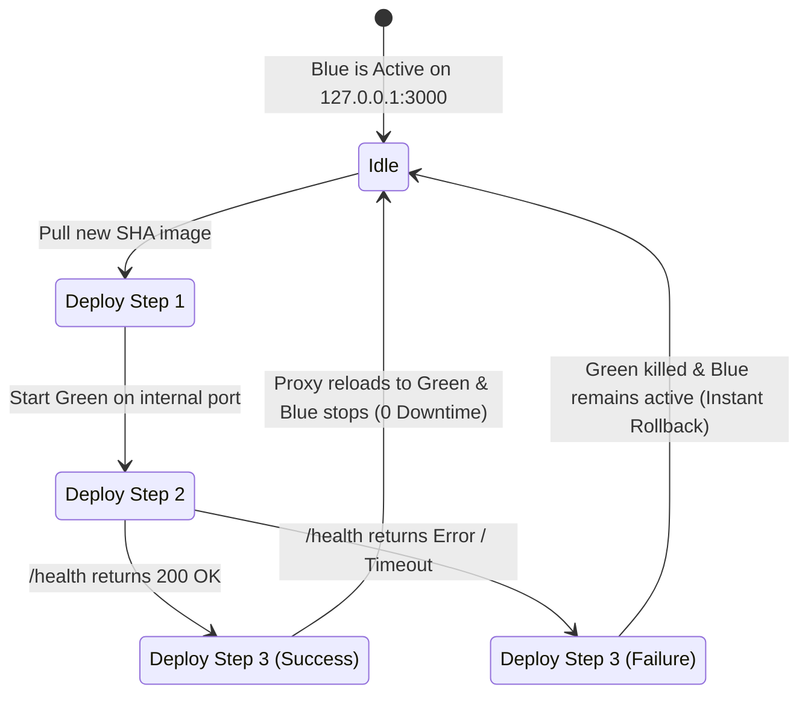

# System Architecture & Infrastructure Overview

This document provides a comprehensive breakdown of the cloud infrastructure, CI/CD pipelines, containerization, and networking architecture for the Todo DevOps application.

---

## 1. High-Level Architecture Diagram

---

## 2. Component Breakdown

### 2.1 Frontend Application Layer
- **Framework**: React 19 + TypeScript + Vite + Tailwind CSS.
- **Serving Engine**: Multi-stage Docker build utilizing unprivileged `nginxinc/nginx-unprivileged:alpine-slim`.
- **Health Check Endpoint**: Dedicated `/health` endpoint returning `{"status":"healthy"}` (HTTP 200 OK) with logging disabled to avoid polluting access logs.
- **SPA Routing**: Configured with `try_files $uri $uri/ /index.html;` to support client-side routing.

---

### 2.2 Terraform Infrastructure as Code (IaC)
- **S3 Remote Backend**: Centralized remote state with AES-256 encryption (`prod/terraform.tfstate`).
- **ECR Module**:
  - Secure container registry with vulnerability scanning on push.
  - **Lifecycle Policy**: Protects the `latest` tag permanently and automatically expires older image versions/SHAs after **3 days** to optimize storage costs.
- **OIDC Module**:
  - OpenID Connect federation allowing GitHub Actions to authenticate directly with AWS without long-lived access keys (`AWS_ACCESS_KEY_ID` / `AWS_SECRET_ACCESS_KEY`).
  - Scoped strictly to repository `RohanSinghProgrammer/todo-devops`.
- **Lightsail Module**:
  - Ubuntu instance provisioned with 2GB swap space and automated Docker installation via `user_data`.
  - Static IP attachment for stable domain mapping.
  - Firewall configuration allowing TCP ports `22` (SSH), `80` (HTTP), and `443` (HTTPS).

---

### 2.3 CI/CD Automation Pipeline

---

## 3. Zero-Downtime Blue-Green Deployment Model

1. **Host NGINX (SSL Termination)**: Always listens on ports 80/443 and proxies to `http://127.0.0.1:3000`.
2. **`todo-proxy` (Internal Gateway)**: Binds to `127.0.0.1:3000` on the `todo-network` Docker bridge.
3. **Application Slots**:
   - **Slot Blue**: `todo-app-blue:8080`
   - **Slot Green**: `todo-app-green:8080`
4. **Traffic Switch**: When the idle slot passes health checks, `todo-proxy` reloads its upstream configuration via `nginx -s reload`, seamlessly transferring active traffic with **zero dropped connections**.
