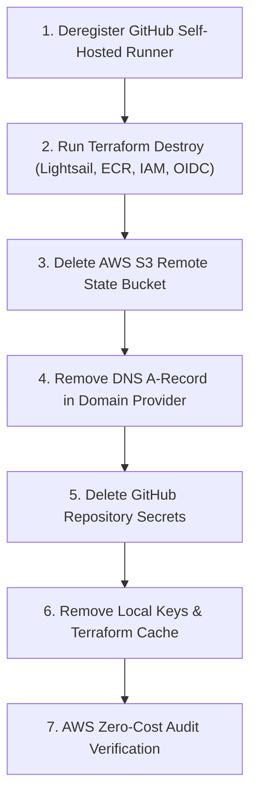

# Project Cleanup & Teardown Guide

This guide details how to completely destroy and clean up all project resources to ensure that **no cloud resources are left running** and **no ongoing AWS charges are incurred**.

---

## 📋 Teardown Overview

To leave a zero-cost footprint, resources must be cleaned up in the following order:



---

## Step 1: Deregister the GitHub Self-Hosted Runner

Before destroying the Lightsail VM, cleanly remove the self-hosted runner from your GitHub repository so it does not remain in an "Offline" orphan state.

### Option A: Via SSH (Recommended)
If your Lightsail instance is still running:
```bash
ssh -i todo-app/terraform/environments/prod/lightsail_key.pem ubuntu@<LIGHTSAIL_PUBLIC_IP>

cd ~/actions-runner
sudo ./svc.sh stop
sudo ./svc.sh uninstall
./config.sh remove --token <YOUR_RUNNER_REMOVAL_TOKEN>
exit
```
*(You can generate a runner removal token in GitHub: **Settings $\rightarrow$ Actions $\rightarrow$ Runners $\rightarrow$ Click Runner $\rightarrow$ Remove**)*

### Option B: Force Remove from GitHub UI
If you no longer have SSH access or prefer UI:
1. Go to your GitHub repository: **Settings $\rightarrow$ Actions $\rightarrow$ Runners**.
2. Click the three dots (`...`) next to the runner name.
3. Click **Force remove this runner**.

---

## Step 2: Destroy Terraform-Managed Infrastructure

Terraform automatically destroys all provisioned AWS resources.

```bash
cd todo-app/terraform/environments/prod

# Destroy all managed resources
terraform destroy -auto-approve
```

### What this removes:
- **AWS Lightsail Instance** (`todo-app-prod`) — **Stops VM hourly compute billing immediately.**
- **AWS Lightsail Static IP** (`todo-app-prod-ip`) — Deletes the static IP (unattached static IPs incur charges in AWS if left dangling).
- **AWS Lightsail Key Pair** (`todo-app-prod-key`)
- **AWS ECR Repository** (`todo-app`) — Deletes the container registry and any uploaded Docker images.
- **AWS IAM OIDC Provider** & **IAM Role** (`github-actions-deploy-role`).

---

## Step 3: Delete AWS S3 Remote State Bucket

Terraform state is stored in an external S3 bucket created outside Terraform, so `terraform destroy` deliberately does **not** delete this bucket.

Run the following AWS CLI commands to empty and delete the bucket:

```bash
export AWS_REGION="<YOUR_AWS_REGION>"
export BUCKET_NAME="<YOUR_UNIQUE_S3_BUCKET_NAME>"

# 1. Delete all objects in the bucket
aws s3 rm "s3://$BUCKET_NAME" --recursive

# 2. Delete all object versions and delete markers (if versioning was enabled)
aws s3api delete-objects \
  --bucket "$BUCKET_NAME" \
  --delete "$(aws s3api list-object-versions \
    --bucket "$BUCKET_NAME" \
    --output json \
    --query '{Objects: Versions[].{Key:Key,VersionId:VersionId}}')" 2>/dev/null || true

aws s3api delete-objects \
  --bucket "$BUCKET_NAME" \
  --delete "$(aws s3api list-object-versions \
    --bucket "$BUCKET_NAME" \
    --output json \
    --query '{Objects: DeleteMarkers[].{Key:Key,VersionId:VersionId}}')" 2>/dev/null || true

# 3. Delete the S3 bucket itself
aws s3api delete-bucket --bucket "$BUCKET_NAME" --region "$AWS_REGION"
```

---

## Step 4: Remove DNS A-Record

To prevent potential subdomain takeover or stale routing:
1. Log in to your DNS provider (Cloudflare, Route 53, Namecheap, GoDaddy, etc.).
2. Locate the `A` record pointing `<YOUR_SUBDOMAIN>` or `@` to `<LIGHTSAIL_PUBLIC_IP>`.
3. **Delete the DNS record**.

---

## Step 5: Clean Up GitHub Repository Secrets

Remove the repository secrets configured for AWS OIDC authentication:

1. Navigate to: **Settings $\rightarrow$ Secrets and variables $\rightarrow$ Actions**.
2. Delete:
   - `AWS_OIDC_ROLE_ARN`
   - `AWS_REGION`

---

## Step 6: Clean Up Local Sensitive Files & Cache

Remove generated private SSH keys and cached Terraform state files:

```bash
cd todo-app/terraform/environments/prod

# Remove private SSH key
rm -f lightsail_key.pem

# Remove local Terraform state cache
rm -rf .terraform
rm -f .terraform.lock.hcl
rm -f terraform.tfstate*
```

---

## Step 7: Zero-Cost Verification Audit

Run these quick inspection commands with the AWS CLI to guarantee that **zero billable resources** remain in your AWS account:

```bash
export AWS_REGION="<YOUR_AWS_REGION>"

echo "=== 1. Checking Lightsail Instances ==="
aws lightsail get-instances --region "$AWS_REGION" --query "instances[].name" --output table

echo "=== 2. Checking Lightsail Static IPs ==="
aws lightsail get-static-ips --region "$AWS_REGION" --query "staticIps[].name" --output table

echo "=== 3. Checking ECR Repositories ==="
aws ecr describe-repositories --region "$AWS_REGION" --query "repositories[].repositoryName" --output table

echo "=== 4. Checking S3 Buckets ==="
aws s3 ls | grep "<YOUR_UNIQUE_S3_BUCKET_NAME>" || echo "S3 bucket confirmed deleted!"

echo "=== 5. Checking IAM Deploy Role ==="
aws iam get-role --role-name github-actions-deploy-role 2>&1 || echo "IAM Role confirmed deleted!"
```

### Expected Output for All Checks:
- Lightsail instances: **Empty (`None` or `[]`)**
- Lightsail static IPs: **Empty (`None` or `[]`)**
- ECR repositories: **Empty / `todo-app` does not exist**
- S3 bucket: **Confirmed deleted**
- IAM role: **`NoSuchEntity` / Confirmed deleted**

Once these return empty, your AWS account is completely clean with **$0.00** remaining recurring charges from this project.
