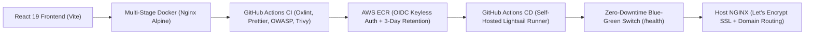

# Todo DevOps Project Documentation

Welcome to the **Todo DevOps Project** documentation hub. This repository contains a production-ready DevOps implementation featuring Infrastructure as Code (Terraform), keyless CI/CD authentication (AWS OIDC), automated container security scanning, and zero-downtime Blue-Green deployments with automated rollback.

---

## 📚 Documentation Index

- **[System Architecture & Infrastructure Overview](ARCHITECTURE.md)**: Detailed breakdown of the cloud infrastructure, network topology, security model, and Mermaid flow diagrams.
- **[End-to-End Setup & Deployment Guide](STEP_BY_STEP_SETUP_GUIDE.md)**: Step-by-step instructions for provisioning the infrastructure from scratch, setting up remote state, configuring GitHub Secrets, installing self-hosted runners, and securing custom domains with Let's Encrypt SSL.
- **[Project Cleanup & Teardown Guide](PROJECT_CLEANUP_GUIDE.md)**: Step-by-step teardown instructions to destroy all AWS infrastructure, remove runners, delete state buckets, and verify a zero-cost footprint.

---

## 🛠️ DevOps Architecture At A Glance

---

## 🚀 Key Features

- **Keyless Authentication (AWS OIDC)**: Zero static AWS secrets stored in GitHub Actions.
- **Automated Security Guardrails**: OWASP Dependency Vulnerability Checker + Aquasec Trivy Image Scanning.
- **Cost-Optimized Artifacts**: AWS ECR Lifecycle policy retaining `latest` while expiring commit SHAs after 3 days.
- **Zero-Downtime Blue-Green Deployments**: Atomic traffic switching via NGINX upstream reloads with zero dropped connections.
- **Automated Rollback Engine**: Real-time `/health` check validation before traffic cutover; instant rollback on failure.
- **Automated SSL/TLS**: Free Let's Encrypt certificates managed and auto-renewed with Certbot.
